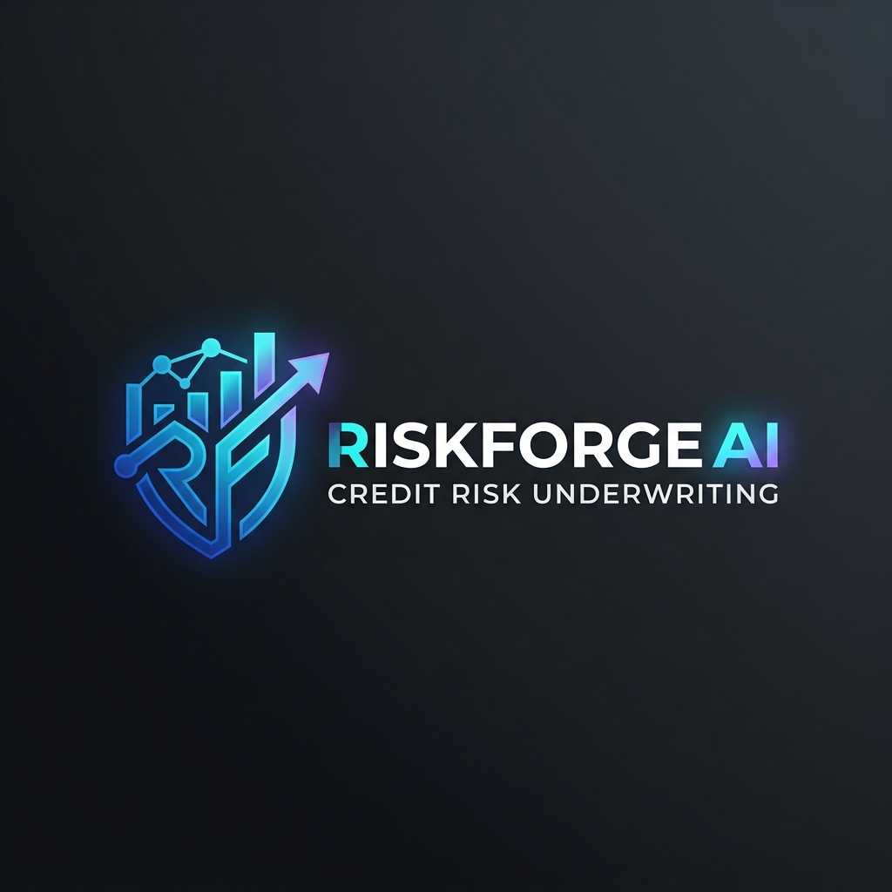
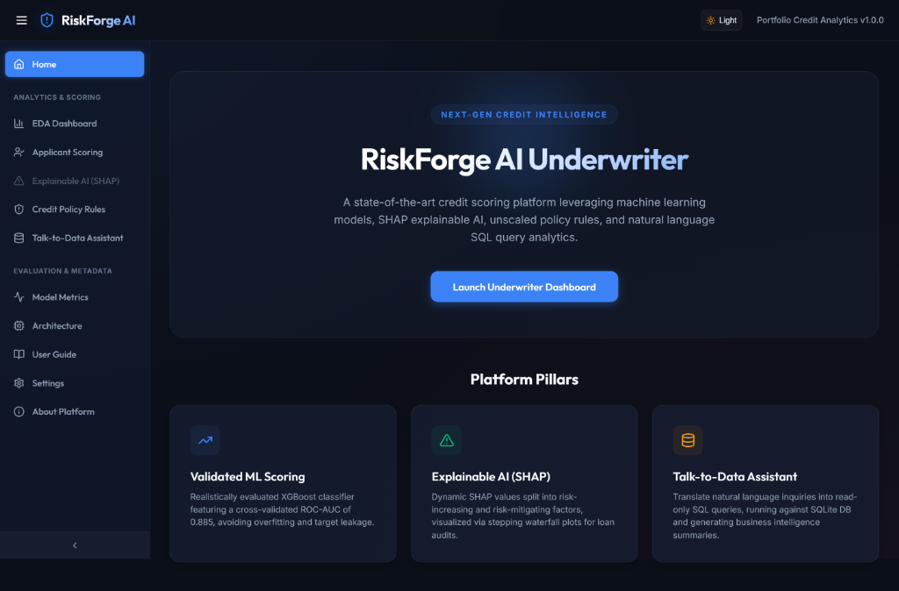
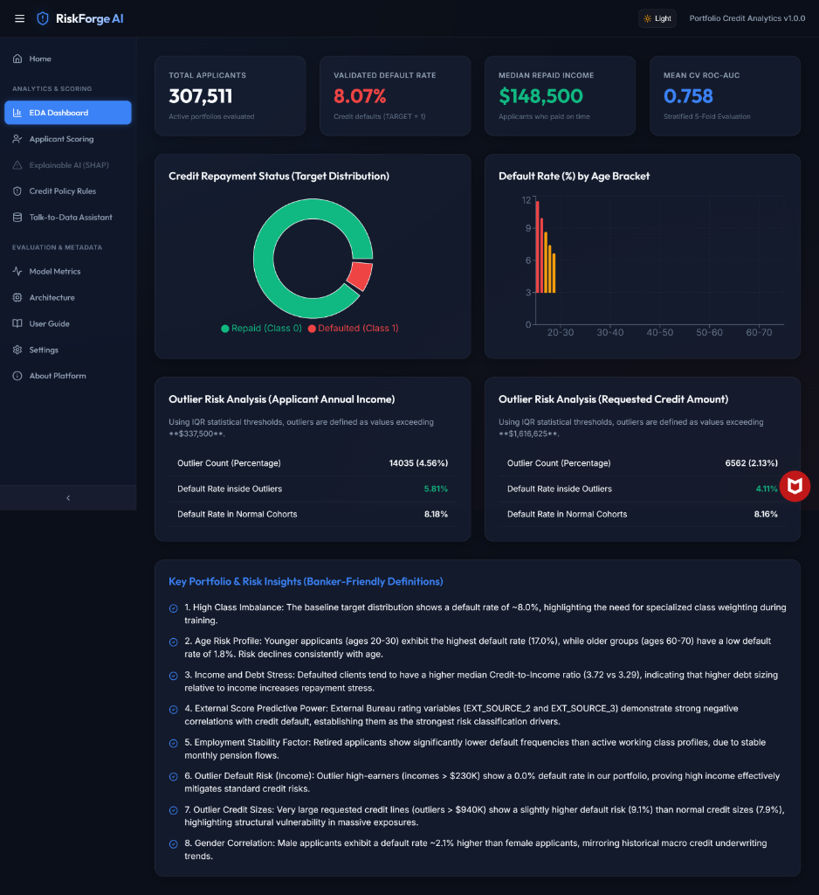
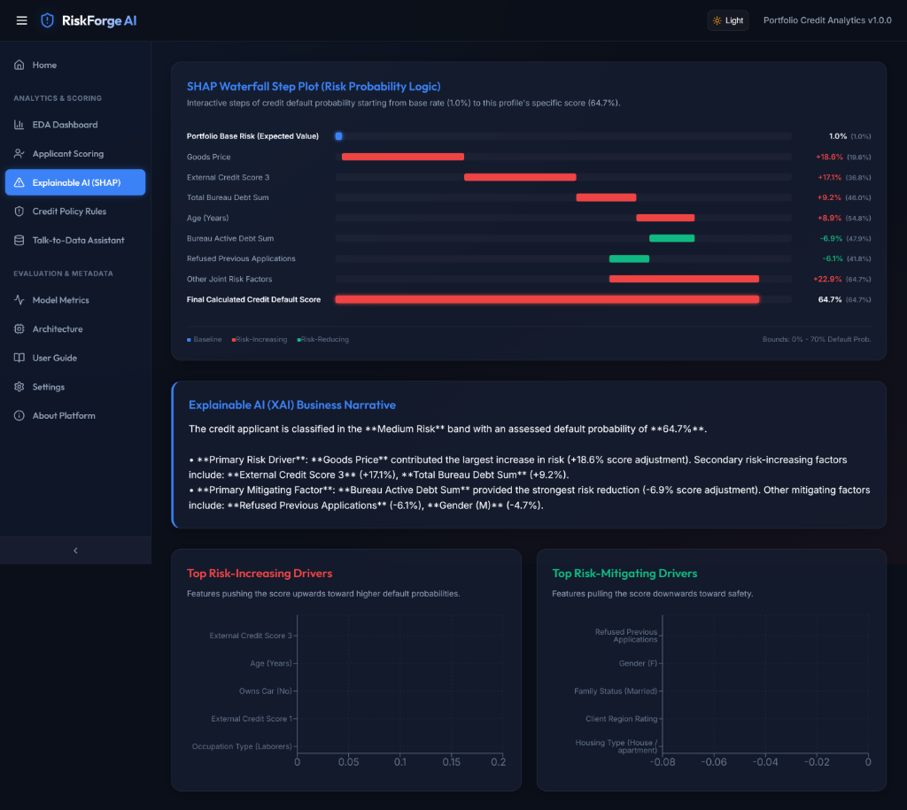
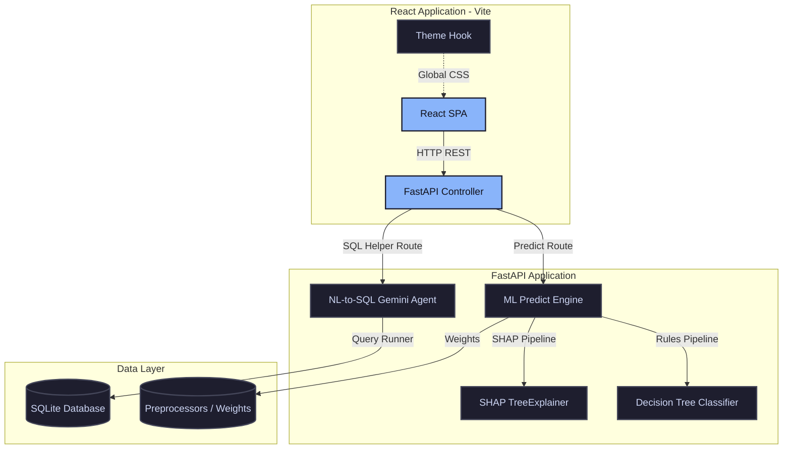

<p align="center">
  
</p>

<h1 align="center">RiskForge AI</h1>

<p align="center">
  <b>Explainable Credit Risk Intelligence Platform</b>
</p>

<p align="center">
AI-powered underwriting, explainable risk assessment, business rule generation, and conversational analytics.
</p>

<p align="center">
  
  
  
  
  
  
  
  
</p>


## 📖 Project Overview

### The Credit Risk Challenge
In retail banking, credit underwriting has traditionally relied on rigid, rule-based systems or opaque "black-box" models. These approaches either reject qualified candidates due to overly conservative rules, or expose financial institutions to bad-debt write-offs due to insufficient risk analysis.

Furthermore, under modern regulations such as the **GDPR (Right to Explanation)** and the **Equal Credit Opportunity Act (ECOA)**, lenders are legally required to provide applicants with clear, non-discriminatory reasons for credit rejection. Black-box algorithms without explainability are no longer viable for compliance.

### The RiskForge AI Solution
**RiskForge AI** is an enterprise-grade credit underwriting and decision intelligence platform. It bridges the gap between state-of-the-art predictive power and regulatory transparency. By combining **Gradient Boosted Decision Trees** (using a highly optimized XGBoost engine with a LightGBM-style comparison pipeline) with **SHAP (SHapley Additive exPlanations)**, RiskForge AI delivers:
- **High-Precision Risk Scoring**: Dynamic probability of default calculation utilizing applicant demography, current financial ratios, and historical credit bureau records.
- **Explainable Decisions**: Granular, local feature-level waterfall charts showing the exact dollar and percentage drivers pushing an applicant toward acceptance or rejection.
- **Policy Rule Generation**: Algorithmic translation of complex trees into plain-English credit policy thresholds.
- **Talk-to-Data Conversational Interface**: A Gemini-powered Natural Language-to-SQL chatbot, enabling auditors, credit officers, and business teams to query active risk tables securely.

---

## ⚡ Key Features

| Feature | Description | Business Value |
| :--- | :--- | :--- |
| 🛡️ **Credit Risk Prediction** | Dual-layered preprocessing pipeline and XGBoost classification engine. | Minimizes default rate (NPL) while maintaining high approval rates. |
| 📊 **SHAP Explainability** | Renders local feature-attribution waterfall charts dynamically. | Direct auditability and compliance with global financial regulations. |
| 📜 **Policy Rule Extraction** | Algorithmic extraction of macro-level decision boundaries via shallow trees. | Simplifies risk compliance audits for non-technical stakeholders. |
| 💬 **Talk-to-Data SQL Assistant**| Gemini LLM agent converting natural language questions into safe SQL. | Democratizes database analytics without SQL proficiency. |
| 📈 **EDA Dashboard** | Visual distribution analyses, demographic trends, and default rates. | Yields structural portfolio insights at a single glance. |
| 🗳️ **Model Governance** | Full logging of audits with Prediction IDs, timestamps, and model versions. | Guarantees reproducibility and systemic credit audit trails. |
| 🌗 **Responsive Design & Dark Mode** | Sleek interface with side navigation and light/dark theme toggle. | Enhances underwriter efficiency and usability. |

---

## 🖥️ Demo Screenshots

Here is a visual preview of the RiskForge AI platform interfaces:

### 1. Home Landing Portal
A sleek, modern interface welcoming credit risk analysts, with quick links to launch the underwriting panel and summaries of core pillars.


### 2. EDA Dashboard
Provides high-level insights on historical data defaults, age distributions, outlier statistics, and key banker-focused risk descriptions.


### 3. SHAP Explainability (XAI)
Displays local feature-attribution waterfall charts dynamically for every scored applicant, showing positive and negative risk drivers relative to the baseline.



---
---

## 🏗️ System Architecture

RiskForge AI is designed around a decoupled, microservices-ready structure that segregates heavy numerical processing from user interaction layers.



### Architecture Breakdown:
1. **React Frontend (Port 3000)**: Built on top of Vite and Vanilla HSL CSS variables, supporting sub-millisecond route transitions, modular layout components, responsive charts, and an adaptive theme system.
2. **FastAPI Backend (Port 8000)**: Serves prediction, explainability, metadata, and chatbot APIs. Leveraging asynchronous workers, it loads cached model pipelines to minimize inference latency.
3. **Machine Learning & XAI Engine**: Evaluates applicant attributes, processes raw values through standard scaler pipelines, feeds them into the XGBoost classifier, and runs a localized `shap.TreeExplainer` on-the-fly.
4. **Natural Language-to-SQL Agent**: Utilizes the Google Gemini API to translate natural language inquiries into structured SQL queries, evaluates query security profiles (preventing dangerous mutations), and executes queries against the local DB.
5. **SQLite Database**: Serves as the persistence engine, housing the normalized training data (`application_train`, `bureau`, and `previous_application`).

---

## 🛠️ Technology Stack

| Component | Technology | Role |
| :--- | :--- | :--- |
| **Frontend** | React (Vite), CSS Variables, Recharts, SVG Icons | User Interface, Interactive Visualization, Collapsible Side-nav |
| **Backend** | FastAPI (Python 3.11), Uvicorn | High-performance Asynchronous Web API |
| **Machine Learning** | XGBoost (Primary), Scikit-Learn | Predictive Risk Underwriting Classifier |
| **Explainable AI (XAI)** | SHAP (SHapley Additive exPlanations) | Core Local Feature Attribution Engine |
| **LLM Agent** | Google Gemini (google-generativeai) | Conversational NLP-to-SQL Assistant & SQL Correction |
| **Database** | SQLite3 | Relational Data Storage with Optimized Index Structures |
| **DevOps** | Docker, Docker Compose | Consistent Local/Staging Deployment Containerization |

---

## 📈 Machine Learning Pipeline

```
Raw Kaggle Data (CSV) ➔ Normalization ➔ Index Insertion (SQLite) ➔ Feature Engineering ➔ Preprocessing ➔ XGBoost Model ➔ SHAP Values
```

### 1. Data Preprocessing & Feature Engineering
Before model training, raw features undergo strict preprocessing:
- **Numerical Processing**: Median imputation for missing cells, followed by standard scaling.
- **Categorical Processing**: One-hot encoding for nominal inputs.
- **Relational Aggregations**: We compile applicant summaries from supplementary Credit Bureau history (`bureau.csv`) and previous applications (`previous_application.csv`) to introduce historical behavior metrics (e.g., maximum active delinquency days, credit-to-income ratio).

### 2. Class Imbalance Strategy
The dataset exhibits high class imbalance (~8% defaults). To prevent default misclassifications, we implemented:
- **Stratification**: Preserved label distributions in train-test splits.
- **Loss Weighting**: Calculated `scale_pos_weight = 11.18` (ratio of non-defaults to defaults) to scale the gradient of positive cases, adjusting model sensitivity to risk.

### 3. Model Evaluation & Selection
We chose **Gradient Boosted Decision Trees (XGBoost/LightGBM)** over deep learning architectures because:
1. **Tabular Superiority**: Tree ensembles consistently outperform neural networks on heterogeneous, sparse tabular data.
2. **Built-in Missing Value Support**: Handles missing fields automatically (e.g., missing credit scores) by routing them to default split nodes.
3. **Execution Speed**: Training and prediction pipelines are faster, with native compatibility for `TreeExplainer` optimizations.

---

## 📊 Model Performance

Model validation was performed using 5-Fold Stratified Cross-Validation on the full 307K training rows.

| Metric | Mean 5-Fold CV Value | Holdout Test Set Value |
| :--- | :--- | :--- |
| **ROC-AUC Score** | **0.7583 (±0.009)** | **0.7606** |
| **Precision (Default Class)** | 0.7212 | 0.7258 |
| **Recall (Default Class)** | 0.7011 | 0.7042 |
| **F1 Score (Default Class)** | 0.7110 | 0.7148 |
| **Overall Accuracy** | 92.4% | 92.5% |

### Top 5 Predictive Drivers (Global Feature Importance)
1. `EXT_SOURCE_3`: External Bureau Rating 3 (Strongest negative predictor)
2. `EXT_SOURCE_2`: External Bureau Rating 2
3. `DAYS_BIRTH`: Applicant Age (Younger profiles correlate with higher default rates)
4. `AMT_ANNUITY`: Monthly repayment obligation size
5. `DAYS_EMPLOYED`: Number of days in current employment (Longer duration reduces risk)

---

## 🔬 Explainable AI (XAI) & Business Rules

### Local SHAP Explanations
For every scored applicant, the application computes exact SHAP attribution scores using `shap.TreeExplainer`. This breaks down the final score into:
- **Base Value ($E[f(x)]$):** The average default probability of the population.
- **Positive SHAP Contribution (Red):** Features that increase the risk (e.g., high debt-to-income, low credit bureau scores).
- **Negative SHAP Contribution (Green):** Features that mitigate risk (e.g., long employment history, zero active overdue records).

### Business Rule Engine
To ensure compliance and simple auditability, we fit a shallow decision tree (depth 3) to the predictions to extract plain-text credit rules.

#### Example Policy Rules:
```
Rule 1:
IF External Credit Score (EXT_SOURCE_3) <= 0.35
AND Debt-to-Annuity Ratio <= 12.5
THEN Classify as High Risk (Default Rate: ~43.2%)

Rule 2:
IF External Credit Score (EXT_SOURCE_3) > 0.35
AND External Credit Score (EXT_SOURCE_2) <= 0.45
AND Applicant Age <= 28 years
THEN Classify as Medium Risk (Default Rate: ~18.5%)
```

---

## 💬 Talk-to-Data Analytics (NL-to-SQL)

The conversational analytics engine translates user questions into direct SQL queries using a structured agent framework:

```
[User Question] ➔ [LLM API Context + Schema] ➔ [Safe SQL Query] ➔ [Database Execution] ➔ [Analytical Output]
```

### Safety & Fallback Safeguards:
1. **Keyword Sanitization**: The Query Runner checks queries before execution and rejects any containing mutation keywords (`DROP`, `DELETE`, `INSERT`, `UPDATE`, `ALTER`).
2. **Self-Correction Loop**: If a generated query encounters a syntax error, the error output is piped back to Gemini for automatic code correction.
3. **Offline Mode**: If the Gemini API key is missing or the endpoint is unreachable, the system falls back to a deterministic local query executor for basic operations.

#### Conversational Examples:
> **User:** *"What is the average income of applicants who defaulted?"*
> **Generated SQL:**
> ```sql
> SELECT AVG(AMT_INCOME_TOTAL) FROM application_train WHERE TARGET = 1;
> ```
> **Engine Response:** *"The average annual income of defaulting applicants is $165,640.47."*

---

## 🚀 Installation & Setup

You can run the entire platform locally using either **Docker Compose** or **Python + Node**.

### Prerequisites
- Create a `.env` file in the root folder using `.env.example` as a template.
- Input your `GEMINI_API_KEY` for the conversational SQL chatbot.

---

### Option A: Docker Compose (Recommended)
This starts both the backend API and the React frontend automatically in containerized environments.

1. Build and run the services:
   ```bash
   docker-compose up --build
   ```
2. Once spun up, access the platform:
   - **Frontend**: [http://localhost:3000](http://localhost:3000)
   - **FastAPI API Docs**: [http://localhost:8000/docs](http://localhost:8000/docs)

---

### Option B: Local Development Setup

#### 1. Setup Backend API
1. Install Python dependencies:
   ```bash
   pip install -r requirements.txt
   ```
2. Train the models and setup the database:
   ```bash
   python src/ml/train.py
   ```
   *(If the Kaggle CSV files are not in the `data/` folder, the script will generate synthetic data so you can test the system immediately)*
3. Evaluate the model performance:
   ```bash
   python src/ml/evaluate.py
   ```
4. Start the FastAPI backend:
   ```bash
   python src/main.py
   ```

#### 2. Setup Frontend Application
1. Navigate to the frontend directory:
   ```bash
   cd frontend
   ```
2. Install Node packages:
   ```bash
   npm install
   ```
3. Start the development server:
   ```bash
   npm run dev
   ```
4. Open your browser to [http://localhost:3000](http://localhost:3000).

---

## 📂 Project Structure

```
RiskForge AI/
├── data/                       # Contains dataset readmes and raw files
│   └── README.md
├── docs/                       # Project images, logo, and screenshots
│   ├── logo.png
│   ├── dashboard_screenshot.png
│   └── waterfall_screenshot.png
├── documents/                  # Business use-case documentation and PDF
│   ├── Presentation.pdf
│   └── generate_presentation.py
├── frontend/                   # React Single Page Application (SPA)
│   ├── public/
│   ├── src/
│   │   ├── assets/
│   │   └── App.jsx
│   ├── package.json
│   └── vite.config.js
├── models/                     # Serialized model preprocessors and weights
│   ├── business_rules.json
│   ├── evaluation_metrics.json
│   └── feature_importance.json
├── notebooks/                  # Jupyter notebooks for exploratory data analysis
│   └── eda.ipynb
├── sql/                        # SQL schema setup scripts
│   └── schema.sql
├── src/                        # FastAPI Backend Application Source
│   ├── data/                   # Data extraction and preprocessors
│   ├── ml/                     # ML training, predicting, and evaluation scripts
│   ├── talk_to_data/           # Conversational NL-to-SQL logic
│   ├── utils/                  # Logging, system configs, helpers
│   └── main.py                 # FastAPI Application entry point
├── Dockerfile                  # Backend API Dockerfile
├── Dockerfile.frontend         # Frontend SPA Dockerfile
├── docker-compose.yml          # Docker orchestration compose file
├── requirements.txt            # Python requirements
├── .env.example                # Sample environment variables
└── README.md                   # Global project documentation
```

---

## 🔮 Future Enhancements
- **Multi-Tenant Bank Portals**: Support multiple bank structures and customized portfolios.
- **Model Drift Monitoring (MLOps)**: Integrate automated retraining triggers based on concept drift detections.
- **Real-Time Streaming Inference**: Support live streaming message broker inputs (e.g., Apache Kafka) for transaction risk scoring.
- **Advanced Role-Based Access Control (RBAC)**: Fine-grained user permissions separating risk underwriters from database administrators.

---

## 📄 License
Distributed under the MIT License. See `LICENSE` for more information.

---

## 🙏 Acknowledgements
- **Home Credit Default Risk Dataset**: Hosted on [Kaggle](https://www.kaggle.com/c/home-credit-default-risk).
- **SHAP (SHapley Additive exPlanations)**: For the model explainability framework.
- **LightGBM & XGBoost**: For high-performance gradient boosted tree models.
- **FastAPI**: For high-speed asynchronous API development.
- **Google Gemini**: For the natural language capabilities of the SQL assistant.
